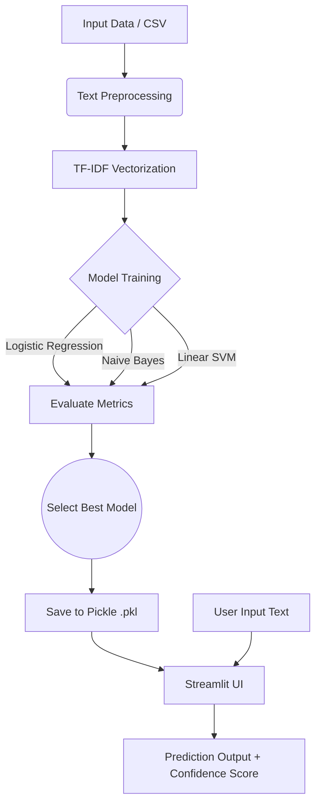

# 🎬 Sentiment Analysis on Movie Reviews

A complete end-to-end Machine Learning project that analyzes movie reviews (and product reviews) to predict whether the sentiment is **Positive** or **Negative**. 

This project features text preprocessing using NLTK, training multiple machine learning models using Scikit-Learn, and an interactive modern dark-mode web application built with Streamlit.

---

## 🚀 Features
- **NLP Text Preprocessing**: Automated lowercasing, punctuation removal, stopword elimination, and lemmatization.
- **TF-IDF Vectorization**: Converts raw text into meaningful numerical vectors.
- **Model Comparison**: Trains and evaluates Logistic Regression, Naive Bayes, and Linear SVM algorithms.
- **Interactive Dark-Mode UI**: Clean, modern web application powered by Streamlit.
- **Real-time Prediction**: Enter your own reviews and receive instant predictions accompanied by a confidence score.
- **Data Visualizations**: View model accuracy charts, a confusion matrix of the best model, sentiment distributions, and dynamically generated word clouds.
- **Bonus**: Handles both Movie and Product Reviews smoothly based on semantic patterns.

---

## 📁 Project Structure

```text
madhu/
│
├── dataset/                  # Directory for raw data (CSV)
├── models/                   # Directory for saved pickle models & metrics
├── app.py                    # Streamlit frontend application
├── train_model.py            # Python script to preprocess data and train ML models
├── requirements.txt          # Python dependencies list
└── README.md                 # Project documentation
```

---

## 🛠️ Setup Instructions

### 1. Prerequisites
Ensure you have Python 3.8+ installed on your system.
You can check your python version by running:
```bash
python --version
```

### 2. Install Dependencies
Open your terminal or command prompt in this project directory and run:
```bash
pip install -r requirements.txt
```

### 3. Dataset Information & Download Link
The `train_model.py` script is designed to automatically download a fallback sample dataset (NLTK's movie_reviews, 2000 items) if you don't supply a larger one.

**For Best Accuracy (Highly Recommended):**
1. Download the full [IMDb Dataset of 50K Movie Reviews from Kaggle](https://www.kaggle.com/datasets/lakshmi25npathi/imdb-dataset-of-50k-movie-reviews).
2. Extract the downloaded archive.
3. Rename the CSV file to `IMDB Dataset.csv`.
4. Place it inside the `dataset/` directory (create the directory if it doesn't exist).

### 4. Train the Model
Run the training script to preprocess the data, train multiple ML models, and save the most accurate one as a `.pkl` file.
```bash
python train_model.py
```
*Note: This will generate `best_model.pkl`, `tfidf_vectorizer.pkl`, and `results.pkl` inside the `models/` directory.*

### 5. Run the Web Application
Start the Streamlit web server to launch the user interface:
```bash
streamlit run app.py
```
Your browser will open automatically at `http://localhost:8501`.

---

## 🐳 Local Deployment (Docker)

This project contains Docker configurations to run the application in a lightweight container.

### Option A: Using Docker Compose (Recommended)
Build and start the application in one command:
```bash
docker compose up -d
```
The application will be available at `http://localhost:8501`.

### Option B: Using Helper Scripts
- **Windows (PowerShell):** Run `.\run_docker.ps1`
- **Linux/macOS (Bash):** Run `chmod +x run_docker.sh && ./run_docker.sh`

---

## ☁️ Cloud Deployment Steps

### 1. Streamlit Community Cloud
To deploy this project for free on the internet:
1. Push your local repository to a public GitHub repository.
2. Go to [Streamlit Community Cloud](https://share.streamlit.io/) and sign in with GitHub.
3. Click on **"New app"**, select your repository, branch, and set the "Main file path" to `app.py`.
4. Click **"Deploy"**.

### 2. Docker-based Deployments (Render / Railway / Hugging Face Spaces)
Because the project includes a `Dockerfile`, you can easily deploy it on any container-friendly platform:
- **Render:** Create a new **Web Service**, connect your GitHub repo, select **Docker** as the runtime, and Render will build and deploy the container automatically.
- **Hugging Face Spaces:** Create a new Space, select **Docker** as the SDK, and push your repository to Hugging Face.
- **Railway:** Create a new service, connect your GitHub repo, and Railway will automatically detect the `Dockerfile` and deploy the service.

---

## 🏗️ Architecture Diagram



---

## 📸 Sample Output
- **Input:** *"This movie was an absolute masterpiece! The acting was phenomenal..."*
- **Prediction:** 🟢 Positive Sentiment
- **Confidence:** 92.45%

---

## 📝 Technical Stack
- **Language:** Python
- **Machine Learning:** Scikit-Learn
- **Natural Language Processing:** NLTK
- **Data Manipulation:** Pandas, NumPy
- **Frontend Framework:** Streamlit
- **Data Visualization:** Matplotlib, Seaborn, WordCloud
